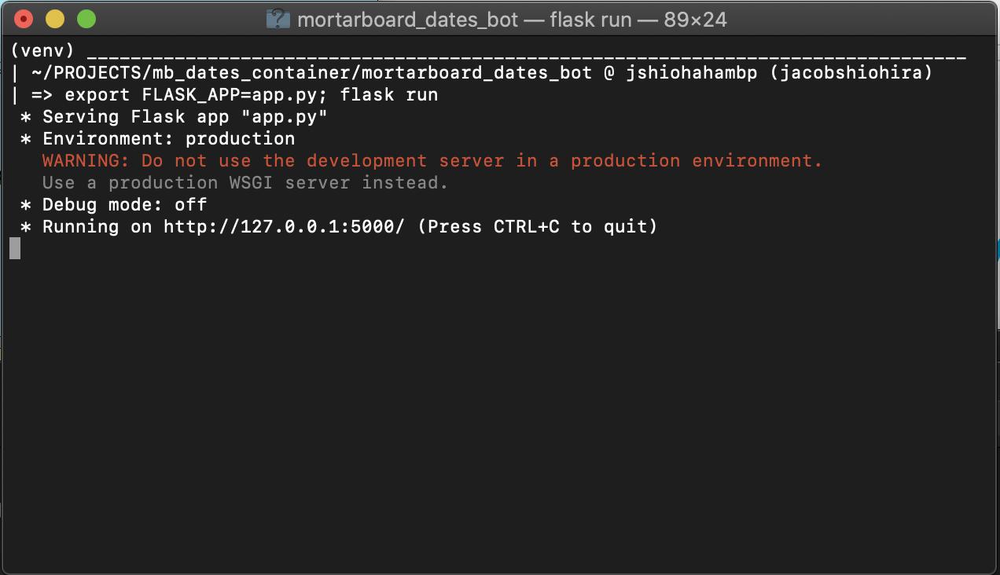

# Mortar Board Dates Bot 
(aka Mortorbot)


## Motivation
Mortorbot automatically creates groupings (usually groups of size 2) between members of the 2020 class of the Black Masque chapter of Mortar Board for weekly mortar dates. Mortar dates are weekly activity between some number of mortar board members to get know each other better. More about us [here](https://www.unl.edu/mortarboard/), or at our social links below!

<div align="center">
    <a href="https://www.facebook.com/UNLMortarBoard/">
        
    </a>
    <a href="https://twitter.com/UNLMortarBoard">
        
    </a>
    <a href="https://www.instagram.com/unl_mortar_board/">
        
    </a>
</div>


## How it works
Mortorbot at it's core is a pretty barebones* Flask application that only responds to `POST` requests at it's root URL (e.g. `https://myurl.com/`). 

When a message is posted to the application, Mortorbot must decide whether or not to reply. Since you can't officially @ bots in GroupMe, Mortorbot will only respond to messages that start with its name. Below, you can see the specific commands that will invoke Mortarbot. 

*I added an asterisk because I also added some dependency injection, but that's about as complex as it gets.

## Usage
Mortorbot will respond to 3 commands.

```
Commands
===============================
1. @mortorbot new dates
    - Mortorbot will generate new groupings (dates)
    - Right now, Mortorbot only generates new dates
      every week on Mondays. Otherwise, Mortorbot will
      inform you of the next date for new dates.

2. @mortorbot current dates
    - Mortorbot will send a reminder of the current
      dates.

3. @mortorbot help
    - Mortorbot will send a reminder of all its use
      cases.
```

## Installation & Running Locally
To run your own version of Mortarbot, you should be able to pull the repo and complete the steps in setup below. Deployment is optional; you could just run locally if that works for you. 

After complete all the steps in the **Setup** section below, you should be able to run Mortorbot locally if you want to. If you did't change the Flask app entrypoint, you should be able to run the following command to spin up the Flask app.

```sh
export FLASK_APP=app.py; flask run
```

If all goes well, you should see something like this.

<div align="center">
    
</div>

**Note**: when running locally, your callback URL will change to `http://127.0.0.1:5000/` when you're running locally. But, that won't be publicly visible. You'll need to use something else (like [localtunnel](https://localtunnel.github.io/www/)) to expose local endpoint.

## Setup

### Create GroupMe Bot
Assuming you want to hook Mortarbot into GroupMe, you will need to register your bot with GroupMe. [Here](https://dev.groupme.com/tutorials/bots) is GroupMe's tutorial on developing bots.

### Config
Mortorbot uses an environment variable to decide how to load config variables. By default, config variables will first be read from environment variables. Of course, if those environment variables do not exist or are not set, the config varialbes will be `None`. 

If the `HEROKU_ENV` is set to `DEV|None`, config variables will be read from a `dev_constants.py` file in the same directory as `constants.py`. The `dev_constants.py` must contain the following variables in order for the program to successfully run.

```python
ENV = [ENVIRONMENT-NAME]

BOT_NAME = [BOT-NAME]
GROUPME_BOT_ID = [GROUPME-BOT-ID]
PYMONGO_DB_NAME = [MONGO-DB-NAME]
PYMONGO_GRAPH_COLLECTION = [GRAPH-COLLECTION-NAME]
PYMONGO_GROUPING_COLLECTION = [GROUPING-COLLECTION-NAME]
PYMONGO_HOSTNAME = [MONGO-HOSTNAME]
PYMONGO_USERNAME = [MONGO-USERNAME]
PYMONGO_PASSWORD = [MONGO-PASSWORD]
```

**Note**: `BOT_NAME` is the name that the bot will respond to. For example, if `BOT_NAME="mycustombot"`, then the bot will respond to messages of the form `@mycustombot [msg]`.

In local development and testing, I recommend setting `ENV=DEV|None`.

### Deployment

As a follow-up to the section above, you should create the  variables listed above as environment variables regardless of how you decide to deploy. I recommend setting `ENV=PROD|TEST`. Realistically, it should be set to anything but `DEV|None`.

I chose [Heroku](https://heroku.com/) for deployment because it is pretty simple to get started with a basic Python Flask app. [Here](https://devcenter.heroku.com/articles/getting-started-with-python) is a helpful article on how to get started with Python on Heroku.